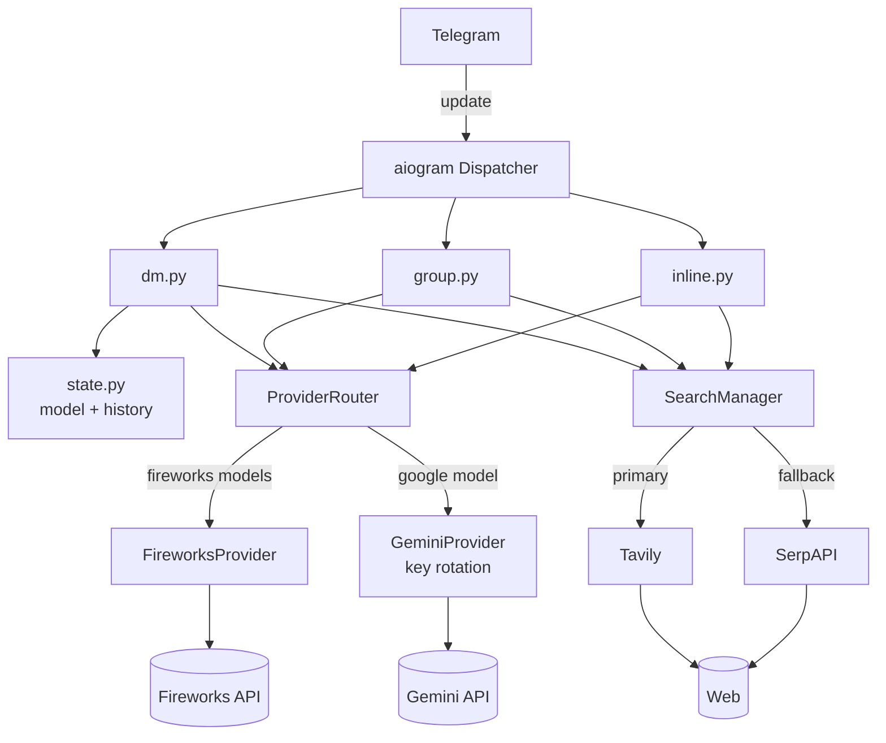

# Telegram Bot Ovasenka

A multi-model AI assistant for Telegram. Chat with several large language models, switch between them on the fly, and get answers grounded in live internet search — all from direct messages, group chats, or inline mode in any conversation.

Built with [aiogram 3](https://docs.aiogram.dev/) on `asyncio`, with a clean provider/search abstraction and a full unit-test suite.

---

## Table of contents

- [Features](#features)
- [Supported models](#supported-models)
- [How it works](#how-it-works)
- [Quick start](#quick-start)
- [Configuration](#configuration)
- [Bot commands](#bot-commands)
- [Usage modes](#usage-modes)
- [Docker deployment](#docker-deployment)
- [Project structure](#project-structure)
- [Architecture](#architecture)
- [Internet search](#internet-search)
- [Gemini key rotation](#gemini-key-rotation)
- [Testing](#testing)
- [Security](#security)
- [Roadmap / known limitations](#roadmap--known-limitations)

---

## Features

- **Direct messages** — one-on-one chat with full conversation memory.
- **Group support** — responds when mentioned (`@yourbot`) or replied to.
- **Inline mode** — type `@yourbot <question>` in any chat to get an answer inline.
- **Multi-model** — five models across two providers, switchable per user with `/model`.
- **Automatic internet search** — the bot detects time-sensitive questions and pulls in live web results before answering.
- **Conversation history** — remembers the last 10 messages per user for context.
- **Resilient** — retries with backoff, Gemini API-key rotation, and search-provider fallback.

## Supported models

| Model         | Provider  | API model ID                                     | Tool use |
|---------------|-----------|--------------------------------------------------|----------|
| DeepSeek V4   | Fireworks | `accounts/fireworks/models/deepseek-v3`          | ✅       |
| Kimi K2.6     | Fireworks | `accounts/fireworks/models/kimi-k2`              | ✅       |
| GLM 5.1       | Fireworks | `accounts/fireworks/models/glm-4`                | ✅       |
| Qwen 3.6 Plus | Fireworks | `accounts/fireworks/models/qwen2p5-72b-instruct` | ✅       |
| Gemini Flash  | Google    | `gemini-2.0-flash`                               | ✅       |

The display names and IDs live in `bot/models.py` — edit `AVAILABLE_MODELS` to add, remove, or re-label models.

## How it works

At a high level, every incoming message flows through the same pipeline:

1. A **handler** (DM, group, or inline) receives the update and extracts the user's text.
2. The bot picks a **model** — the user's choice in DMs, or the default model elsewhere.
3. The **ProviderRouter** maps that model to the right backend (Fireworks or Gemini).
4. If the question looks time-sensitive, the **search layer** fetches live web results and feeds them to the model as context.
5. The model's answer is sent back, split across multiple messages if it exceeds Telegram's 4096-character limit.

## Quick start

### Prerequisites

- Python 3.11+
- A Telegram bot token from [@BotFather](https://t.me/BotFather)
- A [Fireworks AI](https://fireworks.ai) API key
- One or more [Google Gemini](https://aistudio.google.com/apikey) API keys
- *(Optional)* [Tavily](https://tavily.com) and/or [SerpAPI](https://serpapi.com) keys for internet search

### Installation

```bash
# 1. Clone
git clone https://github.com/stravvbery/telegrambotovasenka.git
cd telegrambotovasenka

# 2. Configure — copy the template and fill in your keys
cp .env.example .env
# then edit .env in your editor

# 3. Install dependencies (a virtualenv is recommended)
python -m venv .venv && source .venv/bin/activate
pip install -r requirements.txt

# 4. Run
python run.py
```

If a required key is missing, the bot fails fast at startup with a clear message telling you exactly which variables are unset.

## Configuration

All configuration comes from environment variables, loaded from a local `.env` file (see `.env.example`).

| Variable            | Description                                                                     | Required |
|---------------------|---------------------------------------------------------------------------------|----------|
| `BOT_TOKEN`         | Telegram Bot API token from @BotFather                                          | **Yes**  |
| `FIREWORKS_API_KEY` | Fireworks AI API key                                                            | **Yes**  |
| `GEMINI_API_KEYS`   | Comma-separated Google Gemini keys; multiple keys enable automatic rotation      | **Yes**  |
| `TAVILY_API_KEY`    | Tavily search key (primary search backend)                                      | No       |
| `SERPAPI_KEY`       | SerpAPI key (search fallback if Tavily fails)                                   | No       |
| `FIRECRAWL_API_KEY` | Firecrawl key for scraping full page content from a URL                          | No       |
| `DEFAULT_MODEL`     | Default model ID for new users and group chats (default: `gemini-flash`)        | No       |

Without any search keys the bot still works — it just answers from the model's own knowledge (except Gemini, which always uses its built-in Google Search grounding).

## Bot commands

| Command          | Description                                   |
|------------------|-----------------------------------------------|
| `/start`         | Welcome message                               |
| `/help`          | Show available commands                       |
| `/model`         | Pick which AI model to use (inline keyboard)  |
| `/clear`         | Clear your conversation history               |
| `/search <query>`| Run an explicit web search and see raw results|

## Usage modes

- **Direct message** — just talk to the bot. It remembers your last 10 messages and the model you selected with `/model`.
- **Group chat** — add the bot to a group and either mention it (`@yourbot what's the weather in Tokyo?`) or reply to one of its messages. Groups use the default model and don't keep history.
- **Inline** — in any chat, type `@yourbot <your question>` (at least 3 characters). The bot answers using Gemini Flash for speed, with a 12-second timeout.

> **Note:** for group and inline modes to work, enable them in @BotFather — group privacy must be turned **off** (so the bot can read mentions), and inline mode must be turned **on**.

## Docker deployment

The image never bakes secrets in — provide them at runtime with `--env-file`.

```bash
docker build -t telegram-bot .
docker run -d --name telegram-bot --env-file .env telegram-bot
```

## Project structure

```
telegrambotovasenka/
├── run.py                    # Entry point → bot.main:main()
├── requirements.txt
├── Dockerfile
├── .env.example              # Copy to .env and fill in
├── bot/
│   ├── config.py             # Env loading + validation (fail-fast)
│   ├── models.py             # Dataclasses + AVAILABLE_MODELS registry
│   ├── state.py              # In-memory per-user model + history
│   ├── main.py               # Bot/Dispatcher setup, startup/shutdown hooks
│   ├── keyboards.py          # Inline keyboard for model selection
│   ├── tools.py              # Function-calling schema + tool execution
│   ├── handlers/
│   │   ├── dm.py             # Private-chat handlers + commands
│   │   ├── group.py          # Group mention/reply handler
│   │   └── inline.py         # Inline-query handler
│   ├── providers/
│   │   ├── __init__.py       # BaseLLMProvider interface
│   │   ├── fireworks.py      # Fireworks (OpenAI-compatible) provider
│   │   ├── gemini.py         # Gemini provider with key rotation
│   │   └── router.py         # Model → provider routing
│   └── search/
│       ├── __init__.py       # SearchResult + BaseSearchProvider
│       ├── detector.py       # Heuristic "does this need search?"
│       ├── manager.py        # Orchestration + fallback + formatting
│       ├── tavily.py         # Tavily search
│       ├── serpapi.py        # SerpAPI search (fallback)
│       └── firecrawl.py      # Firecrawl URL scraping
└── tests/                    # pytest suite (47 tests)
```

## Architecture



For a deeper walkthrough of each layer and the request lifecycle, see [`docs/ARCHITECTURE.md`](docs/ARCHITECTURE.md).

## Internet search

Two different strategies are used depending on the model:

- **Gemini** uses Google's **native `google_search` grounding** — the model decides when to search and cites results automatically. No external search key needed.
- **Fireworks models** are offered a `web_search` **function-calling tool**. When the model asks to search, the bot runs the query through the search layer and feeds results back for a second turn.
- **Any model, as a fallback** — a lightweight keyword/regex **detector** (`search/detector.py`) flags time-sensitive queries (e.g. "latest", "today", prices, dates) and injects fresh results as context even without tool use.

The `SearchManager` tries **Tavily first** and **falls back to SerpAPI** if Tavily errors, so a single provider outage doesn't take search down.

## Gemini key rotation

Gemini free-tier keys hit rate limits quickly, so `GeminiProvider` supports **multiple keys with round-robin rotation**:

- Keys cycle in round-robin order for each request.
- A key that returns `429`/`5xx` is put on a **60-second cooldown** (rate-limited) or **300-second cooldown** (hard error) and skipped.
- Cooled-down keys automatically rejoin the rotation once their cooldown expires.
- If every key is cooling down, the provider raises a clear "no available keys" error.

Supply as many keys as you like via the comma-separated `GEMINI_API_KEYS`.

## Testing

```bash
pip install -r requirements.txt
python -m pytest tests/ -v
```

The suite (47 tests) covers config parsing/validation, the model registry, in-memory state and history limits, the search detector heuristics, and Gemini key-rotation logic. Tests don't require any real API keys or a `.env` file.

## Security

- **Never commit `.env`.** It's git-ignored; use `.env.example` as the template.
- Secrets are injected at runtime (`--env-file`), never baked into the Docker image.
- If a key is ever exposed, **rotate it immediately** at the provider.

See [`SECURITY.md`](SECURITY.md) for how to report a vulnerability and the full secret-handling policy.

## Roadmap / known limitations

- **State is in-memory** — model selection and history reset when the bot restarts. A persistent store (Redis/SQLite) would fix this.
- **Group chats don't keep history** and always use the default model.
- **Fireworks tool calls** are parsed from formatted text rather than the structured `tool_calls` field — robust for the current flow but worth hardening if you add more tools.
- Model IDs in `AVAILABLE_MODELS` should be kept in sync with what your Fireworks/Google accounts actually serve.

---

*Built with [aiogram](https://docs.aiogram.dev/). PRs welcome.*
