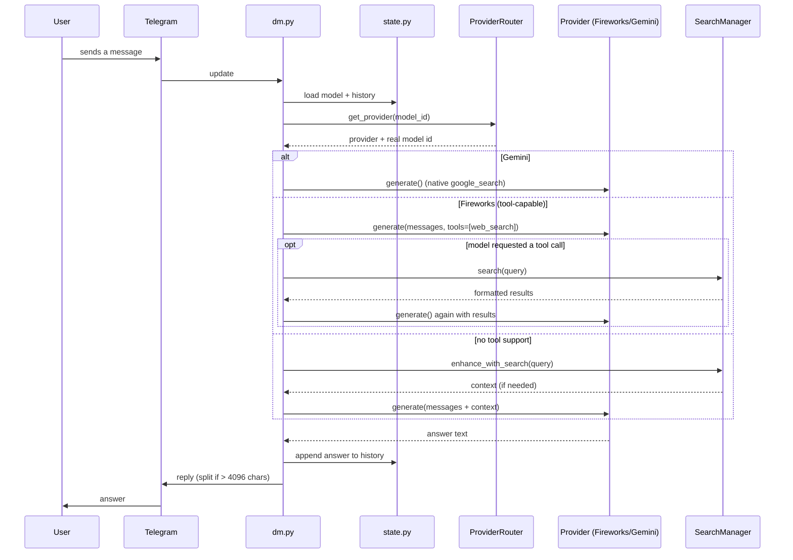

# Architecture

This document explains how Telegram Bot Ovasenka is put together: the layers, the request lifecycle, and the design decisions behind each module. If you just want to run the bot, see the [README](../README.md).

## Design goals

- **Provider-agnostic** — adding or swapping an LLM backend should touch one file.
- **Graceful degradation** — a rate-limited key or a down search provider shouldn't take the whole bot down.
- **Stateless where possible** — everything is `async` and shares a single `aiohttp` session; per-user state is deliberately small and isolated.
- **Testable** — pure logic (routing, detection, rotation, state) is separated from I/O so it can be unit-tested without network calls.

## Layers

The codebase is organized into four cooperating layers.

### 1. Entry & wiring (`run.py`, `bot/main.py`)

`run.py` is a thin launcher that calls `asyncio.run(main())`.

`bot/main.py` builds the `Bot` and `Dispatcher`, validates configuration (fail-fast if required keys are missing), registers the three handler routers, and manages shared resources through lifecycle hooks:

- **`@dp.startup()`** creates one shared `aiohttp.ClientSession`, a `SearchManager`, and a `ProviderRouter`, and stashes them on the `bot` object so handlers can reach them.
- **`@dp.shutdown()`** closes the session cleanly.

Sharing a single session across all requests avoids the overhead of opening a new connection pool per message.

### 2. Handlers (`bot/handlers/`)

Each entry surface has its own aiogram `Router`:

| File        | Trigger                                             | Model               | History |
|-------------|-----------------------------------------------------|---------------------|---------|
| `dm.py`     | Any private-chat message or command                 | User's `/model` pick| Yes (10)|
| `group.py`  | Group message that mentions or replies to the bot   | Default model       | No      |
| `inline.py` | Inline query (`@bot <text>`) of 3+ characters       | Gemini Flash (fast) | No      |

Handlers are intentionally "thin controllers": they parse the update, gather context, delegate to the provider/search layers, and format the reply. Two shared concerns worth noting:

- **Long-message splitting** — Telegram caps messages at 4096 characters, so replies are chunked.
- **Typing indicator** — handlers send a `typing` chat action before the (potentially slow) LLM call.

### 3. Providers (`bot/providers/`)

All model backends implement one interface:

```python
class BaseLLMProvider(ABC):
    async def generate(self, messages, model, tools=None) -> str: ...
```

- **`FireworksProvider`** talks to Fireworks' OpenAI-compatible chat-completions endpoint. It retries up to 3 times with exponential backoff on `429`/`5xx`/network errors, and extracts either the text content or a formatted representation of any `tool_calls`.
- **`GeminiProvider`** talks to Google's Generative Language REST API. It converts OpenAI-style messages to Gemini's `contents` format (merging system messages into the first user turn, since Gemini rejects consecutive same-role turns), attaches the native `google_search` grounding tool, and manages **multi-key rotation** (see below).
- **`ProviderRouter`** owns one instance of each provider and maps a friendly model ID (e.g. `deepseek-v4`) to the right provider and the real API model string. It's the single place handlers go to resolve a model.

### 4. Search (`bot/search/`)

The search layer decides *whether* to search, *runs* the search, and *formats* results for the model.

- **`detector.py`** — a fast, dependency-free heuristic. It flags a query as search-worthy if it contains time-sensitive keywords (`latest`, `today`, `price of`, `breaking`, …) or matches patterns like years (2024–2026) and dates. Used for models without native/tool search.
- **`manager.py`** — orchestrates providers: **Tavily first, SerpAPI as fallback**, plus a static `format_results()` that renders results into compact numbered text for LLM context.
- **`tavily.py` / `serpapi.py`** — implement `BaseSearchProvider.search()` against their respective APIs, normalizing everything to a common `SearchResult` dataclass.
- **`firecrawl.py`** — scrapes the full markdown/content of a specific URL (available to the manager for deeper retrieval).

## Request lifecycle (DM example)



## Gemini key rotation in detail

`GeminiProvider` wraps each configured key in a `KeyState` with a status (`HEALTHY` / `RATE_LIMITED` / `ERROR`) and a `cooldown_until` timestamp. On each request it:

1. Re-enables any key whose cooldown has expired.
2. Picks the next `HEALTHY` key round-robin.
3. On `429`/`5xx`, marks the key rate-limited (60s cooldown); on other errors, marks it errored (300s cooldown).
4. Returns `None` (→ "no available keys" error) only if every key is currently cooling down.

Selection is guarded by an `asyncio.Lock` so concurrent requests don't corrupt the rotation index. This logic is fully covered by `tests/test_gemini_rotation.py`.

## State model

`bot/state.py` keeps two dictionaries in memory, keyed by Telegram user ID:

- **selected model** — falls back to `DEFAULT_MODEL` when unset.
- **history** — a rolling window of the last `MAX_HISTORY` (10) messages.

This is simple and fast but **non-persistent**: a restart clears it. Swapping the in-memory `UserState` for a Redis- or SQLite-backed implementation (same interface) is the natural next step for production use.

## Extending the bot

- **Add a model** — append a `ModelInfo` to `AVAILABLE_MODELS` in `bot/models.py`. If it belongs to an existing provider, nothing else changes.
- **Add a provider** — implement `BaseLLMProvider`, register it in `ProviderRouter`, and point new models' `provider` field at it.
- **Add a search backend** — implement `BaseSearchProvider` and wire it into `SearchManager`.
- **Persist state** — reimplement `UserState` against your datastore, keeping the module-level function API intact.
